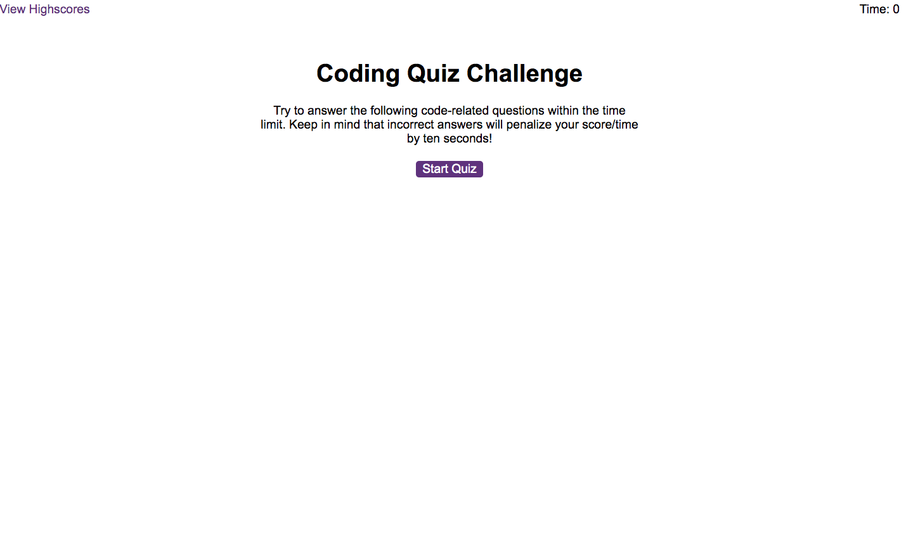
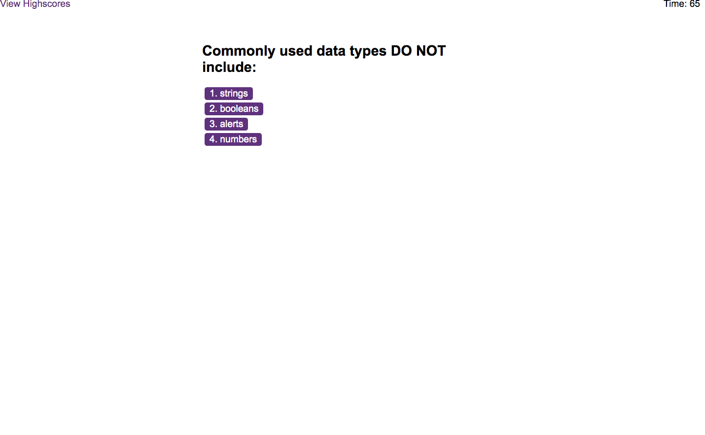
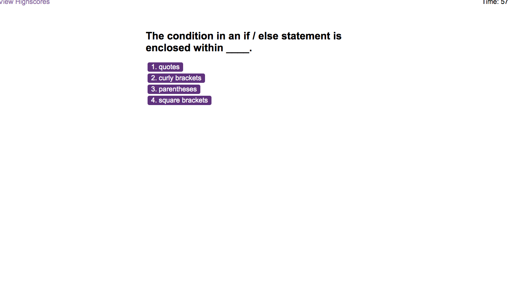
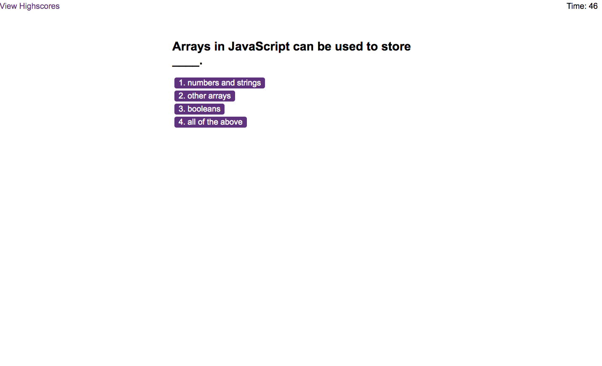
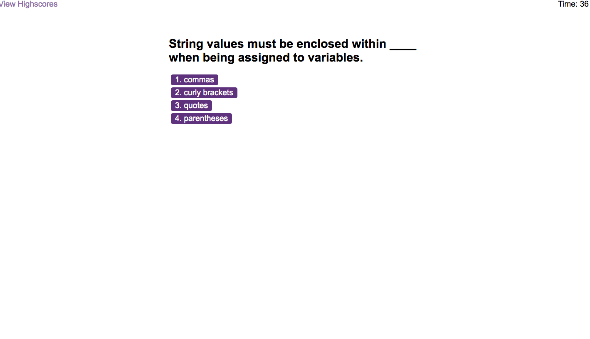
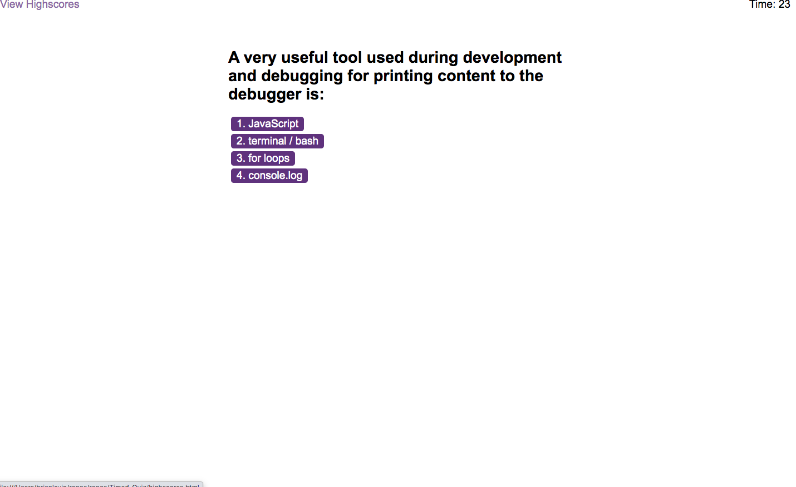
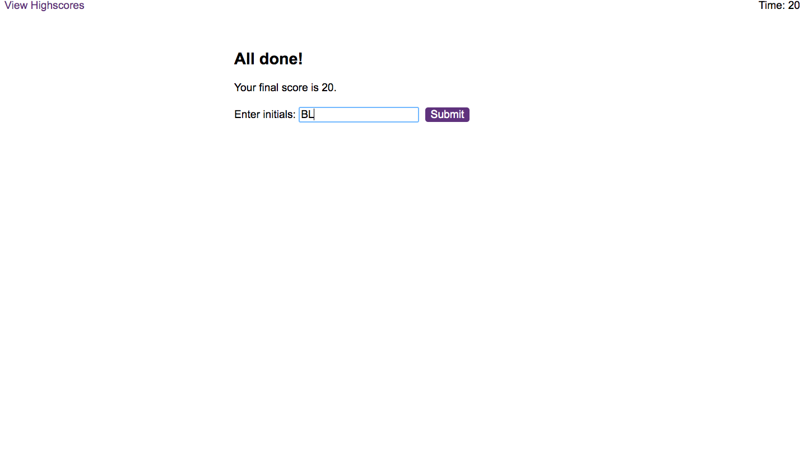
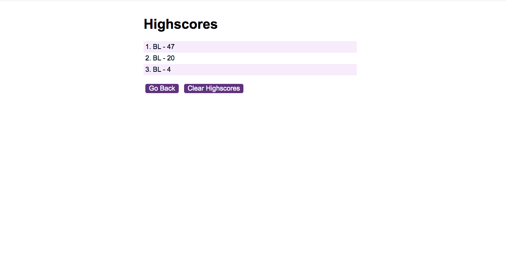

 # Code Quiz
 
  ## Description
In this assignment, we had to create a timed quiz. The quiz had to have a time limit and would subtract certain amount of time  when the user got the wrong answer. No time would be subtracted when the user got the correct answer. The  final score based on the amount of time left is then saved onto a scoreboard  and the user can take the quiz again.
 
  ## Click [here](https://brianlevin.github.io/Timed-Quiz/) for the live app.  
  
Here is the homepage:

This is the first question:

This is the second question:

This is the third question:

This is the fourth question:

This is the fifth question:
## Deployed Application:

Here is where you add your final intials when the quiz is finished:

Here is the scoreboard with all the users scores:

## Libraries,framewprks, and syntax:

- Html
 - Css
 - Javascript
 - Javascript DOM
 - Localstorage

## email
bml201095@gmail.com

