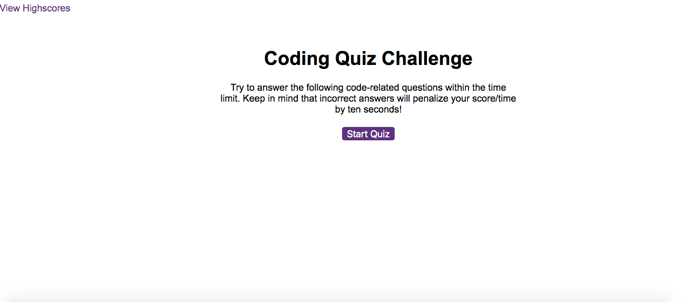

 # Code Quiz
  

 ## Description
In this assignment, we had to create a timed quiz. The quiz had to have a time limit and would subtract certain amount of time  when the user got the wrong answer. No time would be subtracted when the user got the correct answer. The  final score based on the amount of time left is then saved onto a scoreboard  and the user can take the quiz again.

## Deployed Application:
https://brianlevin.github.io/Timed-Quiz/

## github
Github.com/BrianLevin

## email
bml201095@gmail.com

## Libraries,framewprks, and syntax:

- Html
 - Css
 - Javascript
 - Javascript DOM
 - Localstorage

## usage

The user can play as many times as they like and compete with their to see who can get the highest score!

